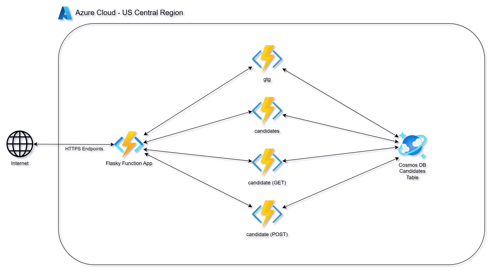
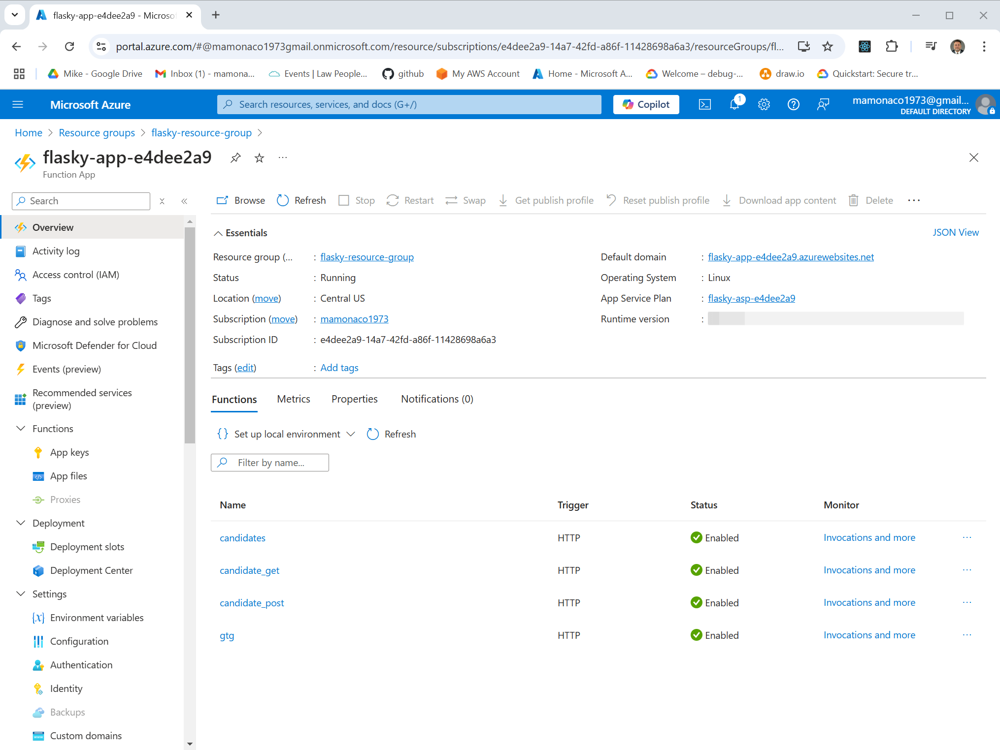
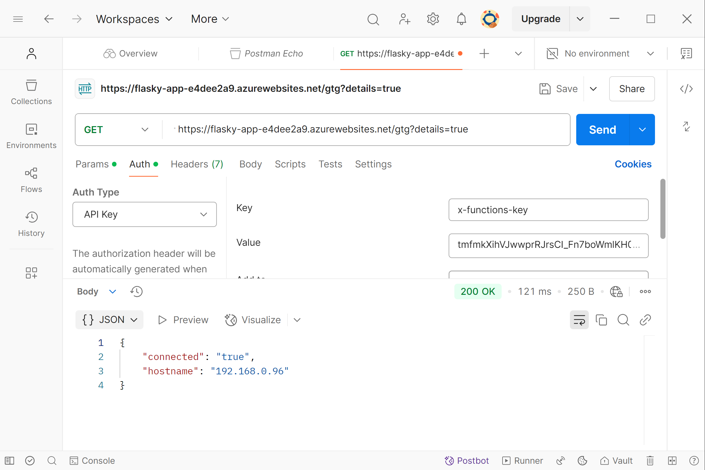

# Deploying Serverless HTTP Endpoints with an Azure Function App

This video complements the [Azure VM Scale Sets](https://youtu.be/a3l4qUfVvGQ) tutorial, where we deployed a simple Python microservice using the Flask framework with Azure Virtual Machine Scale Sets.

In this video, we will deploy a set of Python-based serverless functions using Azure Function App. This includes creating Azure Functions and an Azure Function App to replicate the functionality of the API from the [Azure VM Scale Sets project](https://github.com/mamonaco1973/azure-flask-vmss/blob/main/README.md).

By the end of this video, you’ll learn how to deploy Python-based HTTP endpoints as Azure Functions within an Azure Function App using Terraform.

### Key Tasks Covered:

1. **Deploy Python Code**: Create microservices using Azure Functions within an Azure Function App.
2. **Utilize CosmosDB**: Use a document database for microservice data storage.
3. **Secure HTTP Endpoints**: Implement function keys for securing the endpoints
4. **Clean Up Resources**: Safely destroy all infrastructure created during the deployment process.

## Serverless Computing with Azure 

Serverless computing is a cloud-computing execution model where Azure dynamically manages the infrastructure, including server provisioning, scaling, and maintenance. This approach allows developers to focus entirely on writing and deploying code, without the need to manage or maintain underlying servers. A key use case for serverless computing is building and managing **HTTP endpoints**, making it a powerful solution for web applications, APIs, and microservices.

### Key Characteristics of Azure Serverless Computing

- **No Server Management**: Developers don't need to manage or provision servers; Azure takes care of the underlying infrastructure, allowing more focus on application logic.
- **Automatic Scaling**: Azure serverless applications, including HTTP endpoints, automatically scale up or down based on demand, ensuring consistent performance regardless of traffic volume.
- **Pay-As-You-Go**: Costs are based on actual usage (e.g., number of requests or function execution time), providing cost-efficiency for workloads with varying traffic patterns.

### Azure Functions and Azure Function App for Serverless HTTP-Based Solutions

Serverless computing in Azure is commonly associated with **Azure Functions**, a Functions-as-a-Service (FaaS) platform. These functions are deployed and managed within an **Azure Function App**, which provides the necessary environment to host and execute serverless functions.

- **Azure Functions**: Executes code in response to HTTP(S) requests or other triggers, without the need to provision or manage servers. Azure Functions automatically scale to handle varying levels of traffic and are billed based on execution time and the number of invocations.

- **Azure Function App**: Serves as a container for deploying and managing one or more Azure Functions. It provides built-in integrations, including HTTP triggers, authentication options, and monitoring tools, enabling developers to efficiently deploy and manage serverless solutions.

The combination of Azure Functions and Azure Function App allows developers to build scalable, cost-effective, and fully serverless web applications, APIs, and microservices.



## Prerequisites

* [An Azure Account](https://portal.azure.com/)
* [Install AZ CLI](https://learn.microsoft.com/en-us/cli/azure/install-azure-cli) 
* [Install Latest Terraform](https://developer.hashicorp.com/terraform/install)
* [Install Postman](https://www.postman.com/downloads/) for testing

If this is your first time watching our content, we recommend starting with this video: [Azure + Terraform: Easy Setup](https://youtu.be/wwi3kVgYNOk). It provides a step-by-step guide to properly configure Terraform, Packer, and the AZ CLI.

## Download this Repository

```bash
git clone https://github.com/mamonaco1973/azure-flasky-function-app.git
cd azure-flasky-function-app
```

## Build the Code

Run [check_env](check_env.sh) then run [apply](apply.sh).

```bash
~/azure-flasky-function-app$ ./apply.sh
NOTE: Validating that required commands are found in your PATH.
NOTE: zip is found in the current PATH.
NOTE: az is found in the current PATH.
NOTE: packer is found in the current PATH.
NOTE: terraform is found in the current PATH.
NOTE: All required commands are available.
NOTE: Validating that required environment variables are set.
NOTE: ARM_CLIENT_ID is set.
NOTE: ARM_CLIENT_SECRET is set.
NOTE: ARM_SUBSCRIPTION_ID is set.
NOTE: ARM_TENANT_ID is set.
NOTE: All required environment variables are set.
NOTE: Logging in to Azure using Service Principal...
NOTE: Successfully logged into Azure.
Initializing the backend...
Initializing provider plugins...
- Finding latest version of hashicorp/azurerm...
- Installing hashicorp/azurerm v4.16.0...
- Installed hashicorp/azurerm v4.16.0 (signed by HashiCorp)
Terraform has created a lock file .terraform.lock.hcl to record the provider
selections it made above. Include this file in your version control repository
so that Terraform can guarantee to make the same selections by default when
you run "terraform init" in the future.
[...]
```

### Build Process Overview

The build process consists of two distinct phases:

#### 1. Deploying the Infrastructure 
  - This phase executes the Terraform code to build the CosmosDB and the Azure Function App.
  - A role is deployed to allow the Function App to access the CosmosDB Candidates Table

#### 2. Packaging and Deploying the Python Code
- The Python code is zipped during this phase.
- The AZ cli is used to publish the Python code into the Function App.

#### Final Validation
- After the build completes, the [validate.sh](validate.sh) script is run to verify the solution and ensure everything is functioning as expected.

## Tour of Build Output in the Azure Console

Most of the build can be accessed on the **Azure Function App** page of the Azure Console.



## *Flasky* Endpoint Summary

- [Azure Function Source Code](./02-flasky/function_app.py)

### `/gtg` (GET)
- **Purpose**: Health check.
- **Response**: 
  - `{"connected": "true", "instance-id": <instance_id>}` (if `details` query parameter is provided).
  - 200 OK with no body otherwise.

### `/candidate/<name>` (GET)
- **Purpose**: Retrieve a candidate by name.
- **Response**: 
  - Candidate details (JSON) with status `200`.
  - `"Not Found"` with status `404` if no candidate is found.

### `/candidate/<name>` (POST)
- **Purpose**: Add or update a candidate by name.
- **Response**: 
  - `{"CandidateName": <name>}` with status `200`.
  - `"Unable to update"` with status `500` on failure.

### `/candidates` (GET)
- **Purpose**: Retrieve all candidates.
- **Response**: 
  - List of candidates (JSON) with status `200`.
  - `"Not Found"` with status `404` if no candidates exist.

## Securing HTTP Endpoints with Azure Function App Keys

In the initial deployment of this project, the HTTP endpoints were deployed without any access controls, allowing anyone on the public internet to connect to them. In this section, we will secure the endpoints using **Azure Function App Keys** and test the setup with Postman.

Azure Function App Keys provide an additional layer of security by requiring a key to be included in the request header for access. This ensures that only authorized clients can invoke the endpoints.

### Steps to Secure and Test the Endpoints

#### 1. Modify the `authorization_level` Variable

Update the `authorization_level` variable in the [01-functionapp\variables.tf](01-functionapp\variables.tf) file to **FUNCTION**.

```tf
variable "authorization_level" {
  description = "What type of authorization to require on the function"
  type        =  string
#  default     = "ANONYMOUS" 
  default     = "FUNCTION"
}
```
#### 2. Apply the Terraform Configuration

Run the `apply.sh` script to re-deploy the infrastructure with the updated authorization setting.

#### 3. Validate Authentication Enforcement

Run the `validate.sh` script. You should see Forbidden errors for all API requests because function key is now required.

```bash
~/azure-flasky-function-app$ ./validate.sh
NOTE: Key header for functions is 'x-functions-key:<SECRET_KEY>'
NOTE: Testing the API Gateway Solution.
NOTE: URL for API Solution is https://flasky-app-e4dee2a9.azurewebsites.net/gtg?details=true
✗ good to go failed: Unauthorized
✗ insert failed: Unauthorized
✗ verification failed: Unauthorized
✗ candidate list failed: Unauthorized
```
#### 4. Test APIs with Postman using the key output from `validate.sh`


Use Postman to test the endpoints by setting the `x-functions-key` header value in Postman.



